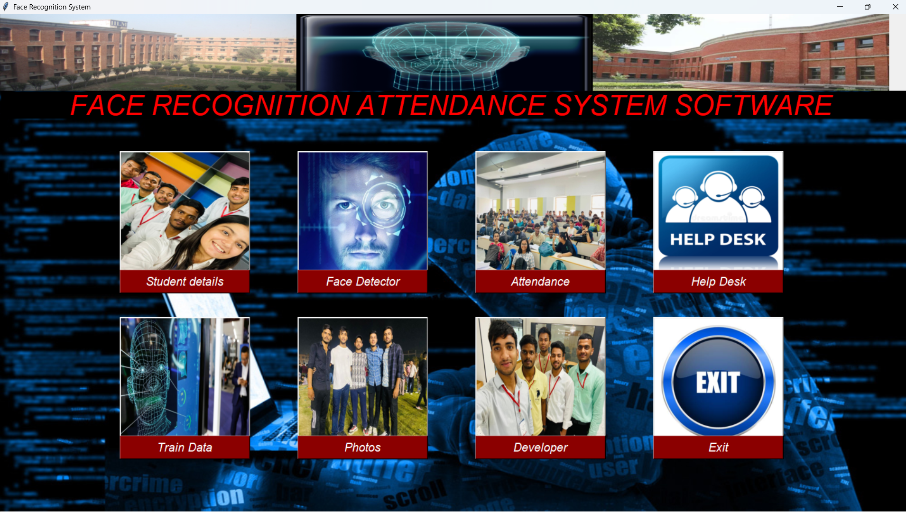

# 🎯 Face Recognition Attendance System

## 📌 Overview

This project is an AI-based attendance system that uses **OpenCV** to detect and recognize faces in real-time and automatically mark attendance.

It helps automate traditional attendance systems with higher accuracy and efficiency.

---

## 🚀 Features

✔ Real-time face detection
✔ Face recognition using OpenCV
✔ Automatic attendance marking
✔ GUI interface using Tkinter
✔ MySQL database integration

---

## 🛠 Tech Stack

* Python
* OpenCV
* Tkinter
* MySQL
* NumPy

---

## 📂 Project Structure

```bash
Face-Recognition-Attendance-System/
│── data/              # Dataset (not included)
│── __pycache__/       # Cache files
│── classifier.xml     # Haar Cascade file
│── student.py         # Main logic
│── train.py           # Model training
│── attendance.py      # Attendance system
```

---

## ▶️ How to Run

1️⃣ Install dependencies

```bash
pip install opencv-python numpy
```

2️⃣ Run the project

```bash
python student.py
```

3️⃣ Capture faces and train the model

---

## 📷 Output / Screenshots

 
---

## 📌 Note

⚠ Dataset is not included due to size.
You can generate your own dataset using the system.

---

## 🚀 Future Improvements

* Add cloud database
* Improve accuracy with deep learning
* Add web-based dashboard

---

## ⭐ If you like this project

Give it a ⭐ on GitHub!
